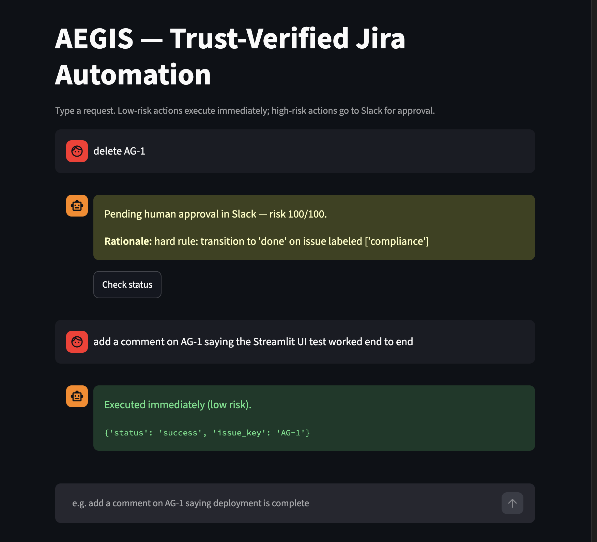
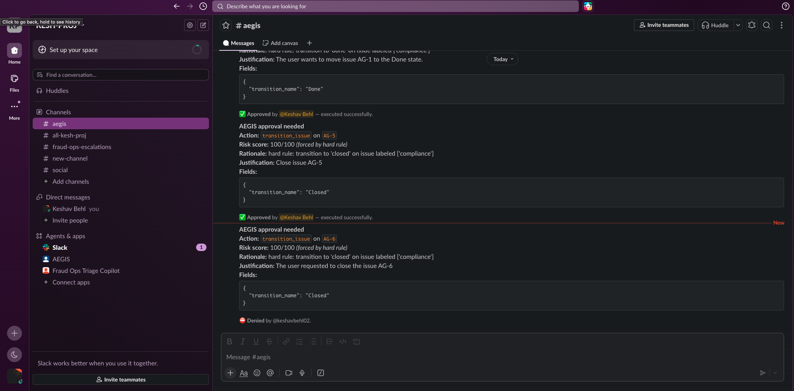

# AEGIS — Agentic Execution & Governance for Intent-verified Systems

A trust-verified automation layer for Jira: a natural-language interface backed by an LLM intent agent, a risk classifier, a signed-action protocol, human approval for high-risk actions, and an immutable audit trail.

> Built AEGIS, a trust-verified automation layer for Jira — a natural-language (Custom GPT) interface backed by a signed-action protocol that risk-scores every autonomous change and routes high-risk actions to human approval, with a full hash-chained audit trail. LLM inference via NVIDIA NIM.

## Architecture

```
 User (chat / Custom GPT / Streamlit)
            │  "close AG-4"
            ▼
   POST /aegis/request
            │
            ▼
   ┌─────────────────┐
   │  Intent Agent    │  NL -> structured ActionProposal
   │  (NVIDIA 8B)     │
   └────────┬─────────┘
            ▼
   ┌─────────────────┐     hard rules (delete / bulk /
   │ Risk Classifier  │◄──  compliance+PCI closures) always
   │  (NVIDIA 70B)    │     force approval, no matter the score
   └────────┬─────────┘
            ▼
      risk_score 0-100
            │
   ┌────────┴────────┐
   │                 │
 < threshold     >= threshold
   │                 │
   ▼                 ▼
 Sign + Execute   Sign + Post to Slack (Approve / Deny)
   │                 │
   │            human clicks
   │                 ▼
   │            Sign + Execute (Approve)  or  log "denied" (Deny)
   │                 │
   └────────┬────────┘
            ▼
   ┌─────────────────┐
   │    Executor      │  verify_token (fail closed) -> Jira REST call
   └────────┬─────────┘
            ▼
   ┌─────────────────┐
   │  Hash-chained     │  every attempt — success, failure, denial,
   │  Audit Log (SQLite)│  or rejected replay — gets exactly one entry
   └─────────────────┘
```

Every signed token is single-use (nonce-checked) and time-limited, so a replayed or stale approval can never execute twice.

## Screenshots

**Chat UI** — a low-risk request executes instantly; a high-risk one (transitioning a
compliance-labeled ticket) is held pending human approval in Slack:



**Slack approval flow** — real approval requests with full risk rationale, one approved and
one denied, each producing a single audit-logged outcome:



## Required accounts

See `.env.example` for the full list: an NVIDIA NIM API key (LLM inference), a Jira Cloud site + API token, and a Slack app with a bot token + signing secret. All have free tiers.

## Setup

1. `python3 -m venv .venv && source .venv/bin/activate`
2. `pip install -r requirements.txt`
3. `cp .env.example .env` and fill in real values
4. `uvicorn app.main:app --reload`
5. `curl http://localhost:8000/health`

For the Slack approval flow to work locally, tunnel your server (e.g. `ngrok http 8000`) and
point your Slack app's Interactivity & Shortcuts Request URL at `<tunnel-url>/slack/interactions`.

## Using AEGIS

With the API running, submit a natural-language request:

```
curl -X POST http://localhost:8000/aegis/request \
  -H "Content-Type: application/json" \
  -d '{"text": "add a comment on AG-1 saying deployment is complete"}'
```

Low-risk requests execute immediately against Jira. High-risk requests are posted to Slack
for human approval and return `pending_approval` — poll `GET /aegis/status/{request_id}` to
see when a decision has been made.

### Chat UI (Streamlit)

```
streamlit run streamlit_app.py
```

A minimal chat front-end that posts to `/aegis/request` and shows the outcome — the free
alternative to wiring this up as a ChatGPT Custom GPT via `openapi/aegis_actions.yaml`.

## Demo

Three scripted scenarios, runnable with the API server (and, for scenarios 2/3, Slack
Interactivity) live:

```
python scripts/demo.py 1   # low-risk comment -> instant auto-execution
python scripts/demo.py 2   # high-risk compliance closure -> Slack approve -> executes
python scripts/demo.py 3   # high-risk request -> Slack deny -> nothing executes
python scripts/demo.py     # runs all three in order
```

Scenarios 2 and 3 each create a fresh compliance-labeled Jira ticket, submit a request to
close it, print a prompt to go click Approve/Deny in Slack, then poll until the decision
resolves and assert the expected outcome.

To inspect the tamper-evident audit trail at any point:

```
python scripts/verify_audit_chain.py
```
